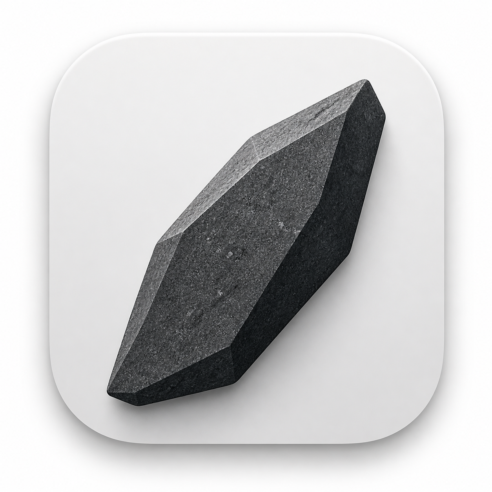
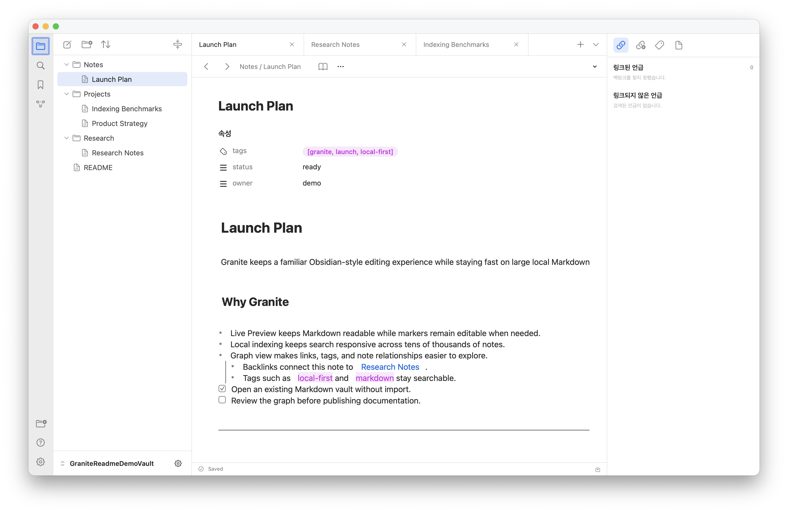
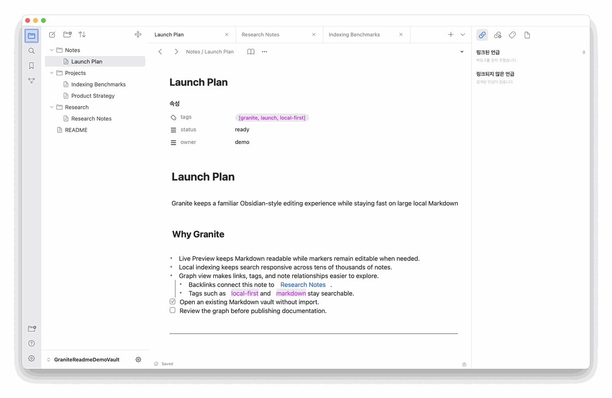
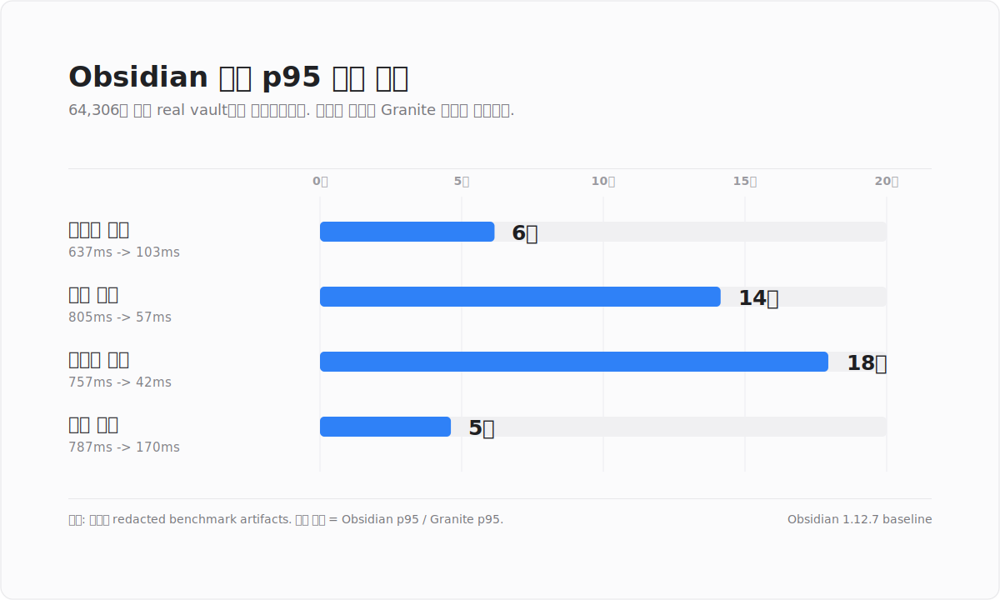
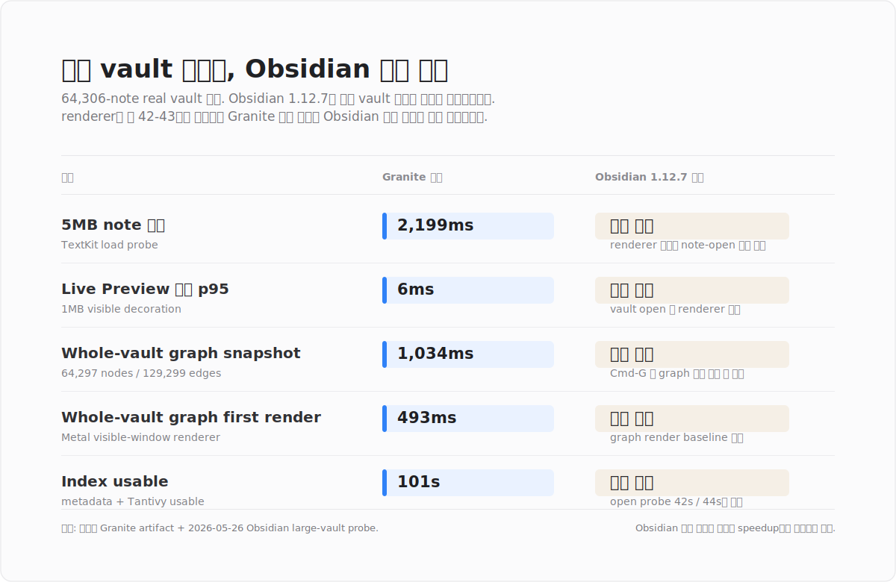

<p align="center">
  
</p>

# Granite

[English](README.md)

Granite는 Obsidian과 비슷한 사용자 경험을 유지하면서도 수만 개 이상의 Markdown 파일을 빠르고 안정적으로 다루기 위해 만든 macOS용 고성능 Markdown 편집기입니다. 로컬 Markdown vault를 직접 열어 읽고, 편집하고, 검색하며, 파일 사이의 연관관계를 그래프 뷰로 탐색할 수 있습니다.

<p align="center">
  
</p>

## 목적

Granite의 목표는 Obsidian에 익숙한 사용자가 자연스럽게 사용할 수 있는 Live Preview 기반 Markdown 편집 경험을 유지하면서, 대규모 vault에서도 검색과 그래프 탐색이 안정적으로 동작하는 네이티브 macOS 앱을 구현하는 것입니다.

- 기존 Markdown 파일과 폴더 구조를 그대로 사용합니다.
- 수만 개 이상의 Markdown 파일을 가진 vault에서도 빠른 검색과 탐색을 목표로 합니다.
- 파일, 링크, 태그, 속성 관계를 기반으로 한 그래프 뷰를 안정적으로 제공합니다.
- Live Preview에서 Markdown 문법을 편집 가능한 형태로 렌더링합니다.
- 파일 트리, 검색, 백링크, 아웃고잉 링크, 태그, frontmatter 속성, 그래프를 한 앱 안에서 제공합니다.
- 저장되지 않은 편집, 외부 변경, 충돌, 앱 종료 같은 흐름에서 원본 Markdown을 보호합니다.
- 대형 vault의 검색과 그래프 탐색을 위해 Rust 기반 인덱싱 엔진을 사용합니다.

## Granite의 장점

- 익숙한 편집 경험: 기존 Markdown을 import하거나 변환하지 않고 Obsidian과 비슷한 Live Preview 흐름을 유지합니다.
- 대규모 vault 성능: Rust 기반 인덱싱 엔진으로 검색과 관계 탐색을 빠르게 유지하는 것을 목표로 합니다.
- 로컬 우선 개인정보 보호: note, index, graph, recovery 데이터는 사용자의 Mac 안에서 처리합니다.
- 네이티브 작업 공간: file, tab, search, backlinks, properties, attachments, graph view를 하나의 macOS 앱 안에서 제공합니다.

## 주요 기능

- 로컬 vault 열기 및 최근 vault 복원
- Markdown 파일 탐색, 탭 기반 편집, 저장 상태 추적
- Native Live Preview
  - heading, list, task, horizontal rule, callout, code, link, tag, embed, properties 렌더링
  - Obsidian에 가까운 table 렌더링과 cell 편집
  - table row/column 삽입, 이동, 복제, 삭제, 정렬, align 메뉴
- 파일명 및 본문 검색
- note inspector
  - backlinks
  - outgoing links
  - tags and properties
  - attachments
- 현재 노트 중심 local graph 및 whole-vault graph
- Apple Intelligence가 사용 가능한 환경에서 Apple Foundation Models 기반 로컬 문서 요약
- 대형/병적 문서에 대한 fallback source mode
- 앱 종료, vault 닫기, 탭 닫기, 파일 이동 중 dirty-state 보호

## 사용 흐름 예시

아래 예시는 공개 문서용으로 생성한 데모 vault만 사용합니다. Granite에서 vault를 탐색하고, 검색 패널로 전환하고, graph view를 확인한 뒤, Apple Foundation Models 로컬 경로로 현재 문서를 요약하는 흐름입니다.

<p align="center">
  
</p>

## 성능 벤치마크

아래 수치는 추정치가 아니라 저장소에 커밋된 redacted benchmark artifact에서 가져온 값입니다. 대형 vault 측정은 Apple M4 Pro / 24GB RAM / macOS 26.4.1 환경에서 `64,306`개 Markdown 파일과 `3,183MB` Markdown 데이터를 기준으로 했습니다. Obsidian 비교 항목은 Obsidian `1.12.7`의 p95 latency를 기준으로 합니다.

### Obsidian 대비 비교

<p align="center">
  
</p>

### 대형 Vault Granite 측정값

아래 항목은 Granite 측정값입니다. 2026-05-26에 동일 local large vault를 대상으로 Obsidian 1.12.7 probe를 실행했지만 완료 baseline을 얻지 못했습니다. 임시 프로필을 사용하고 측정에 불필요한 `bases` / `sync` core plugin을 꺼도 vault open 중 renderer가 약 `42-43s`에 종료되어 대형 vault 렌더링 자체가 실패했고, graph probe는 graph view title까지 도달하지 못했습니다. 따라서 이 차트는 Obsidian 대비 속도 향상 배수가 아니라 Granite 완료 시간과 Obsidian 렌더 실패 상태를 보여줍니다.

<p align="center">
  
</p>

## 사용법

1. `dist/Granite.app`을 실행합니다.
2. 왼쪽 하단의 vault switcher 또는 폴더 아이콘을 눌러 Markdown vault 폴더를 엽니다.
3. 왼쪽 파일 브라우저에서 Markdown 파일을 선택합니다.
4. 중앙 editor에서 Live Preview 상태로 문서를 읽고 편집합니다.
5. 오른쪽 inspector에서 backlinks, outgoing links, tags/properties, attachments를 확인합니다.
6. summary inspector에서 Apple Foundation Models를 이용해 현재 문서를 로컬에서 요약합니다.
7. 왼쪽 ribbon의 graph 아이콘 또는 `Command-G`로 whole-vault graph를 엽니다.

## 빌드 방법

### 요구 사항

- macOS 15 이상
- Xcode Command Line Tools
- Swift 6.1 toolchain
- Rust toolchain with Cargo
- macOS 기본 개발 도구: `sips`, `iconutil`, `codesign`, `plutil`

### 개발 빌드

```sh
swift build --package-path mac-app --product Granite
```

### Rust 엔진 빌드

```sh
cargo build --manifest-path vault-engine/Cargo.toml --release
```

### 앱 패키징

```sh
./scripts/package-macos-app.sh
```

패키징 스크립트는 다음 작업을 수행합니다.

- Rust vault engine을 release로 빌드합니다.
- SwiftPM Granite 실행 파일을 release로 빌드합니다.
- `dist/Granite.app` bundle을 생성합니다.
- `assets/GraniteAppIcon.png`에서 `.icns` 앱 아이콘을 생성합니다.
- `libvault_engine.dylib`를 앱 bundle에 포함합니다.
- 앱을 ad-hoc signing으로 서명합니다.
- smoke test와 Live Preview/Workspace probe를 실행합니다.

생성된 앱:

```sh
open -n dist/Granite.app
```

## 테스트와 검증

```sh
swift test --package-path mac-app
```

자주 쓰는 probe:

```sh
swift run --package-path mac-app Granite --smoke-test
swift run --package-path mac-app Granite --engine-smoke-test
swift run --package-path mac-app Granite --live-preview-probe
swift run --package-path mac-app Granite --live-preview-style-probe
swift run --package-path mac-app Granite --editor-bridge-probe
swift run --package-path mac-app Granite --workspace-tabs-probe
swift run --package-path mac-app Granite --startup-vault-restore-probe
swift run --package-path mac-app Granite --foundation-models-smoke-probe
```

패키지된 앱 검증:

```sh
codesign --verify --deep --strict dist/Granite.app
dist/Granite.app/Contents/MacOS/Granite --live-preview-style-probe
dist/Granite.app/Contents/MacOS/Granite --editor-bridge-probe
dist/Granite.app/Contents/MacOS/Granite --foundation-models-smoke-probe
```

## 기술 스택

- Swift 6.1
- SwiftUI for app shell, panes, settings, help, and native macOS UI
- AppKit and TextKit for Markdown editor, context menus, hit testing, and overlay rendering
- Swift Package Manager
- Rust 2024 edition for the vault engine
- C FFI bridge between Swift and Rust
- Tantivy for full-text indexing/search
- SQLite via `rusqlite` for engine-owned metadata
- Serde/JSON for engine payload encoding
- Apple Intelligence 지원 환경에서 로컬 문서 요약을 수행하는 Apple Foundation Models
- macOS code signing and app bundle tooling

## 라이선스

Granite는 GNU Affero General Public License v3.0 only 조건으로 배포됩니다. 자세한 내용은 [LICENSE](LICENSE)를 참고하세요.

## 개인정보와 로컬 처리

- Granite는 사용자의 Markdown 파일과 vault 데이터를 외부 서버로 전송하지 않습니다.
- 요약 기능은 시스템 모델을 사용할 수 있을 때 사용자의 Mac에서 Apple Foundation Models로 로컬 실행됩니다. 노트 내용은 Granite 서버나 서드파티 LLM API로 전송되지 않습니다.
- 생성된 요약은 오른쪽 inspector에만 표시되며, 원본 Markdown 파일에 자동으로 저장되지 않습니다.
- 사용자의 note, vault 구조, summary, index, graph, recovery 데이터에 대한 소유권과 통제권은 사용자에게 있습니다.
- 검색 인덱싱, 그래프 계산, Live Preview 렌더링은 로컬 머신에서 처리됩니다.
- 사용자의 Markdown source를 변환하거나 import하지 않고, 기존 파일을 그대로 다룹니다.
- 앱이 생성하는 index, graph, recovery 데이터는 로컬 앱 전용 위치에서 관리합니다.
- remote attachment와 unsafe local reference는 inert 상태로 남기며, preview 목적으로 원격 콘텐츠를 가져오지 않습니다.
