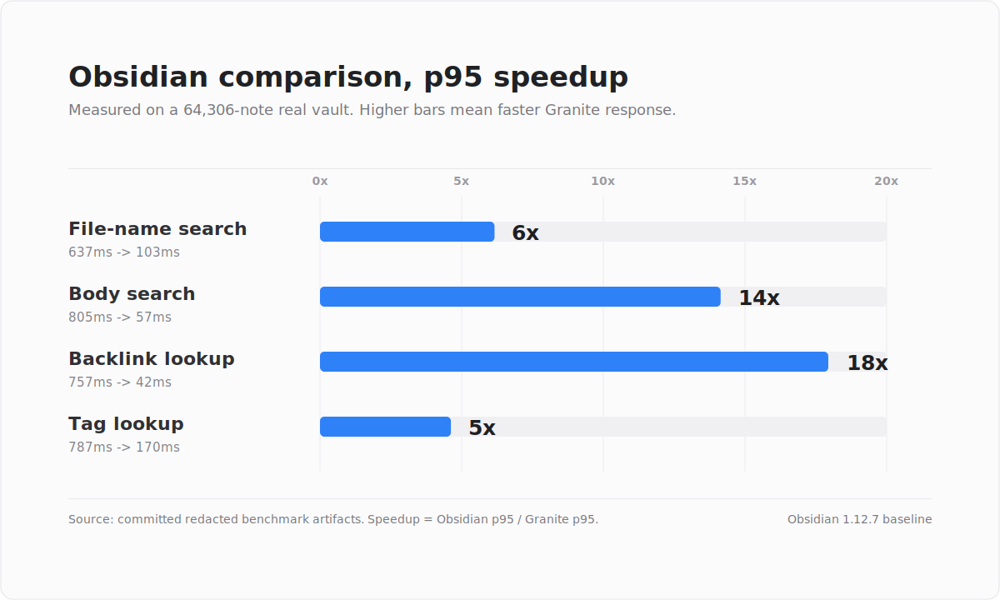
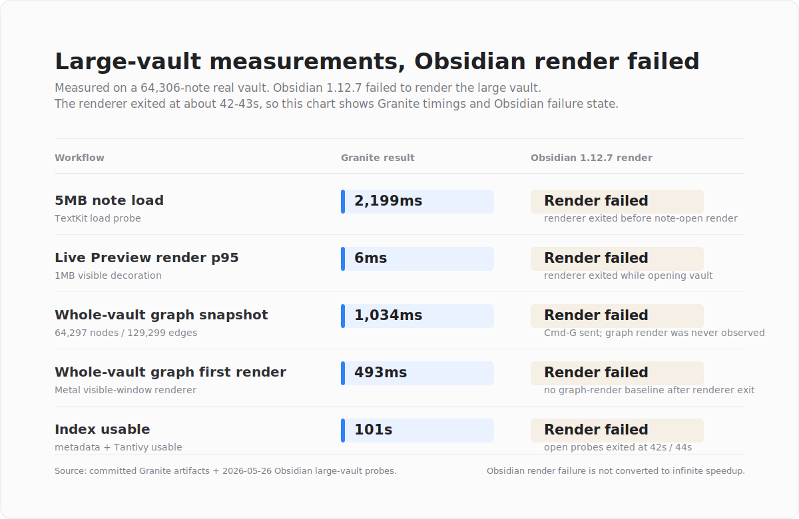

<p align="center">
  
</p>

# Granite

[한국어](README.ko.md)

Granite is a high-performance Markdown editor for macOS that keeps an Obsidian-like user experience while handling large local Markdown vaults. It opens, edits, searches, and renders your existing Markdown files directly, and provides a graph view for navigating relationships across notes.

<p align="center">
  
</p>

## Purpose

Granite is built to provide a native macOS Markdown editing experience that feels familiar to Obsidian users while staying fast and stable on large vaults.

- Use your existing Markdown files and folder structure without import or conversion.
- Keep search and navigation responsive in vaults with tens of thousands of Markdown files.
- Explore file, link, tag, and property relationships through a stable graph view.
- Render editable Markdown through native Live Preview.
- Provide files, search, backlinks, outgoing links, tags, frontmatter properties, and graph views in one app.
- Protect Markdown source during unsaved edits, external changes, conflicts, vault closing, and app quit flows.
- Use a Rust-based indexing engine for large-vault search and graph workflows.

## Why Granite

- Familiar editing: keep an Obsidian-like Live Preview workflow without importing or converting existing Markdown.
- Large-vault performance: use a Rust indexing engine to keep search and relationship navigation responsive.
- Local-first privacy: process notes, indexes, graph data, and recovery state on the user's Mac.
- Native workspace: combine files, tabs, search, backlinks, properties, attachments, and graph views in one macOS app.

## Features

- Open local vaults and restore recent vaults.
- Browse Markdown files, edit in tabs, and track save state.
- Native Live Preview rendering for headings, lists, tasks, horizontal rules, callouts, code, links, tags, embeds, properties, and tables.
- Table rendering and cell editing close to Obsidian's Live Preview behavior.
- File-name and full-text search.
- Note inspector for backlinks, outgoing links, tags/properties, and attachments.
- Current-note local graph and whole-vault graph.
- Local document summaries powered by Apple Foundation Models when Apple Intelligence is available.
- Fallback source mode for large or pathological documents.
- Dirty-state protection while quitting, closing vaults, closing tabs, or switching files.

## Demo Workflow

The example below uses a generated demo vault with mock notes only. It shows Granite browsing a vault, switching to search, exploring the graph view, and summarizing the active note with the local Apple Foundation Models path.

<p align="center">
  
</p>

## Performance Benchmarks

The numbers below come from committed, redacted benchmark artifacts rather than estimated claims. The large-vault runs use `64,306` Markdown files and `3,183MB` of Markdown on Apple M4 Pro / 24GB RAM / macOS 26.4.1. Obsidian comparison rows use Obsidian `1.12.7` and p95 latency.

### Obsidian Comparison

Lower latency is better. Speedup is `Obsidian p95 / Granite p95`; the bar chart is capped at `20x`.

<p align="center">
  
</p>

### Large-Vault Granite Measurements

These rows are published Granite measurements. On 2026-05-26, matching Obsidian 1.12.7 probes were attempted against the same local large vault. Obsidian did not produce a completed baseline: with a temporary profile, and even with `bases` / `sync` disabled to isolate nonessential core plugins, the renderer exited at about `42-43s` while opening the vault, so the large-vault render itself failed. The graph probe never reached a graph-view title. The chart therefore shows Granite timings and Obsidian render failure, not finite speedup claims.

<p align="center">
  
</p>

## Usage

1. Launch `dist/Granite.app`.
2. Open a Markdown vault folder from the lower-left vault switcher or the folder button.
3. Select a Markdown file from the left file browser.
4. Read and edit the note in the central Live Preview editor.
5. Use the right inspector for backlinks, outgoing links, tags/properties, and attachments.
6. Use the summary inspector to summarize the active note locally with Apple Foundation Models when available.
7. Open the whole-vault graph from the left ribbon graph icon or with `Command-G`.

## Build

### Requirements

- macOS 15 or later
- Xcode Command Line Tools
- Swift 6.1 toolchain
- Rust toolchain with Cargo
- macOS development tools: `sips`, `iconutil`, `codesign`, `plutil`

### Development Build

```sh
swift build --package-path mac-app --product Granite
```

### Rust Engine Build

```sh
cargo build --manifest-path vault-engine/Cargo.toml --release
```

### Package The App

```sh
./scripts/package-macos-app.sh
```

The packaging script:

- Builds the Rust vault engine in release mode.
- Builds the SwiftPM Granite executable in release mode.
- Creates `dist/Granite.app`.
- Generates the `.icns` app icon from `assets/GraniteAppIcon.png`.
- Bundles `libvault_engine.dylib`.
- Ad-hoc signs the app bundle.
- Runs smoke tests and Live Preview/Workspace probes.

Launch the packaged app:

```sh
open -n dist/Granite.app
```

## Testing And Verification

```sh
swift test --package-path mac-app
```

Common probes:

```sh
swift run --package-path mac-app Granite --smoke-test
swift run --package-path mac-app Granite --engine-smoke-test
swift run --package-path mac-app Granite --live-preview-probe
swift run --package-path mac-app Granite --live-preview-style-probe
swift run --package-path mac-app Granite --editor-bridge-probe
swift run --package-path mac-app Granite --workspace-tabs-probe
swift run --package-path mac-app Granite --startup-vault-restore-probe
swift run --package-path mac-app Granite --foundation-models-smoke-probe
swift run --package-path mac-app Granite --foundation-models-performance-probe --vault "/path/to/your/vault"
```

The Foundation Models performance probe is a manual private-vault benchmark. It reports only safe case IDs, byte counts, compression ratios, timings, pass/fail state, and skip reasons; it must not emit raw note text, generated summaries, prompts, content hashes, or absolute vault paths.

Packaged app verification:

```sh
codesign --verify --deep --strict dist/Granite.app
dist/Granite.app/Contents/MacOS/Granite --live-preview-style-probe
dist/Granite.app/Contents/MacOS/Granite --editor-bridge-probe
dist/Granite.app/Contents/MacOS/Granite --foundation-models-smoke-probe
dist/Granite.app/Contents/MacOS/Granite --foundation-models-performance-probe --vault "/path/to/your/vault"
```

## Technology Stack

- Swift 6.1
- SwiftUI for the app shell, panes, settings, help, and native macOS UI
- AppKit and TextKit for the Markdown editor, context menus, hit testing, and overlay rendering
- Swift Package Manager
- Rust 2024 edition for the vault engine
- C FFI bridge between Swift and Rust
- Tantivy for full-text indexing/search
- SQLite via `rusqlite` for engine-owned metadata
- Serde/JSON for engine payload encoding
- Apple Foundation Models for local document summaries on supported Apple Intelligence systems
- macOS code signing and app bundle tooling

## License

Granite is licensed under the GNU Affero General Public License v3.0 only. See [LICENSE](LICENSE).

## Privacy And Local Processing

- Granite does not send your Markdown files or vault data to external servers.
- The summary feature uses Apple Foundation Models locally on your Mac when the system model is available; note contents are not sent to a Granite server or a third-party LLM API.
- Generated summaries are shown in the right inspector and are not written back to your Markdown files automatically.
- Your notes, vault structure, summaries, indexes, graph data, and recovery state remain under your ownership and control.
- Search indexing, graph computation, and Live Preview rendering run locally on your machine.
- Granite does not import or transform your Markdown source; it works directly with existing files.
- App-generated index, graph, and recovery data are managed in local app-owned storage.
- Remote attachments and unsafe local references remain inert; Granite does not fetch remote content for preview rendering.
